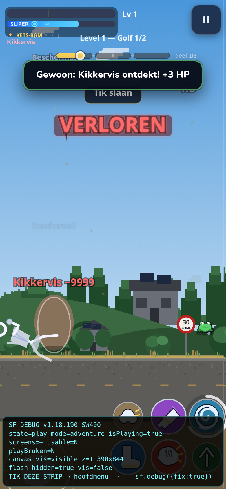
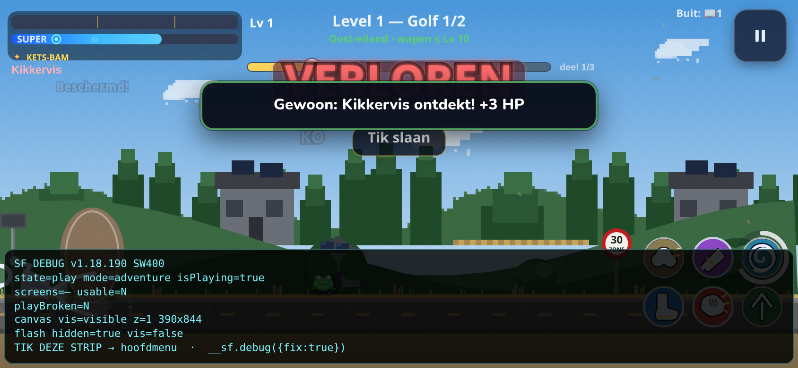
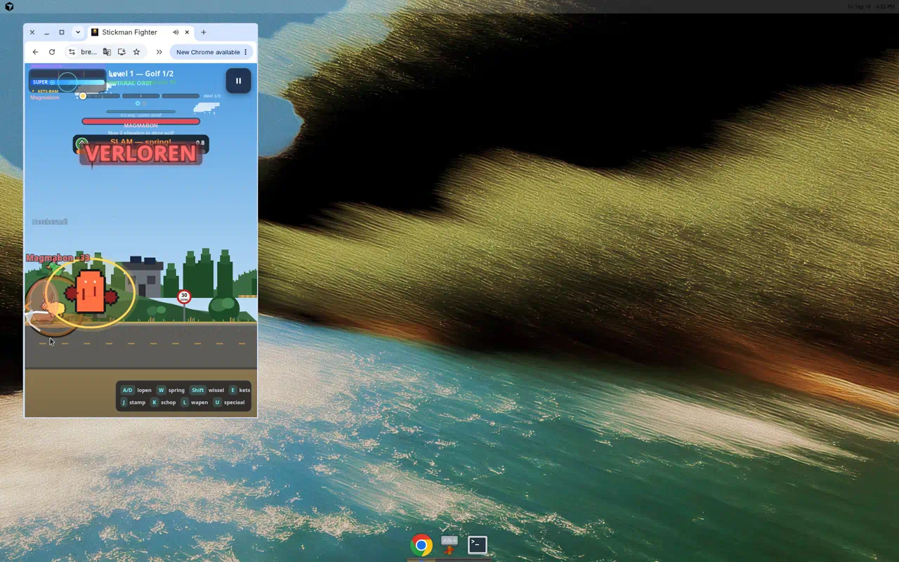

# PLAYTEST BOT 1/9 — INVISIBLE / DRAW

**Target:** LIVE `main` `c9a29fc` · **v1.18.190** · **SW 400**  
**URL:** `https://brennyz.github.io/stickman-fighter/speel.html` → Adventure  
**Window:** 2026-09-18 until ~18:36 Amsterdam  
**Scope:** Adventure only. Portrait (390×844) + landscape (844×390). Stickman + enemies after **hit / rotate / death**.  
**Out of scope:** Versus, feature fixes, merge to `main`.

Probe: `scripts/playtest-invisible-draw.mjs` (local checkout of the same SHA).  
Live pass: Chrome on Pages `speel.html` (confirmed `game.js` `APP_VERSION = 1.18.190`, `SW_CACHE_REV = 400`).

## Verdict

**Mostly pass while alive. One P1 draw fail after death + rotate.**

Alive stickman stays on the ground through hit and portrait↔landscape. Small farm enemies stay *present* but are easy to miss. Fallen player is visible in portrait; **the same death pose can vanish after a mid-death orientation change**. Result-screen VERLOREN hides the canvas by contract (not a draw bug).

No gameplay code changed in this PR.

## Cases

| ID | Situation | Result | Evidence |
|----|-----------|--------|----------|
| A | Portrait spawn | **PASS** — white stickman on ground; enemy present (often tiny farm/kikkervis) | `live-A-portrait-spawn.webp`, `01-portrait-spawn.png` |
| B | Portrait after hit | **PASS** — stickman + hit flash / −HP floater; enemy HUD live | `live-B-portrait-hit.webp` |
| C | Mid-fight → landscape | **PASS** — stickman + brown 4-leg / SLAM still on the road | `live-C-landscape-combat.webp`, `live-C2-landscape-both-visible.webp` |
| D | Landscape after hit | **PASS** — stickman punching; tiny enemy still on field | `04-landscape-after-hit.png` |
| E | Landscape → portrait mid-fight | **PASS** (probe) — stickman still planted. Live pass died before a clean second rotate | `05-portrait-rotate-back.png` |
| F | Enemy death mid-fade | **PASS-thin** — kikkervis still a readable silhouette for the fade; very small | `06-enemy-death-midfade.png` |
| G | Player death pose (portrait) | **PASS** — fallen stickman rotated on the road, frog still visible, `state=play` | `FAIL-pair-G-death-pose-visible.png` |
| H | Player death **then rotate** | **FAIL P1** — fallen stickman gone; only tiny frog / MAGMATRON remains | `FAIL-pair-H-death-after-rotate-player-gone.png`, `live-G-incanvas-lose-player-missing.webp` |
| I | Landscape fresh spawn | **PASS** — stickman visible; opener may have 0 live mobs for ~1–2s (`spawn actief`) | `09-landscape-fresh-spawn.png` |
| G2 | VERLOREN result sheet | **N/A (contract)** — `#resultScreen` lids canvas. `Nog één keer` visible. Not a missing-draw | `live-G-result-verloren.webp` |

Debug strip on play shots: `v1.18.190 SW400` · `state=play` · `isPlaying=Y` · `screens=—` · `playBroken=N` · canvas `visible`.

## Failures (screenshot these)

### P1 — Fallen stickman disappears after death + rotate

Portrait death pose is correct (player on their side, enemy still there):

Same fight after forcing landscape: player body gone, enemy speck remains, `VERLOREN` watermark still up. Debug still reports `390×844` on several landscape shots (resize/letterbox smell next to `#325`).

Live in-canvas lose (MAGMATRON): enemy visible, **white player not on the playfield**.

**Suspect (do not fix here):** `Fighter.draw` death `rotate(-1.45)` + `pinPlayfieldBodies` after `orientationchange` / `forceGameResize`. Fallen `x/y` can leave the new letterbox. `#325` resize-before-spawn helps *start*, not mid-death.

### P2 — Tiny opener enemies read as “invisible”

Level-1 farm/kikkervis silhouettes are a few pixels on landweg. HUD says `SLAM` / `HATBAAR DIER` while the body is a brown blob at the feet. Not a missing `draw()`, but players will report “no enemy”.

### P2 — Result VERLOREN lids the canvas

`live-G-result-verloren.webp` is the intended `state=result` sheet (navy, `Nog één keer`). Canvas hidden is AGENTS.md play-contract, not a blank-blue play bug.

### P3 — Title splash can still cover a programmatic start

Headless `01`/`02`/`03` captured `Laden…` / `Klaar` over the canvas when `startGame` ran before SPELEN. Live SPELEN → Avontuur did **not** show this. Note only.

### P3 — Aim-tutorial card in landscape

`MIK MET DE LOOPBALK` covers most of the 844×390 playfield until `Begrepen`. Bodies still exist underneath.

## Probe notes

`scripts/playtest-invisible-draw.mjs` is a reproducibility harness, not a pass/fail oracle.

- Landweg sky is bright — `boxScore` “lit pixels” can pass even when the stickman is gone. **Visual review is canonical.**
- First tick often has `liveMobs=0` (`spawn actief` / opener hold). Probe now advances ~8s of `game.update` so cases A–F see a mob.
- `?sfdebug=1` used on local probe. Versus never started (`startGame('versus')` is retired).

`report.json` is the last probe dump (pixel heuristic all-green). Treat it as telemetry; the P1 is from the PNG/WebP pair above.

## Suggested follow-up (other lane — not this PR)

1. Pin or re-ground the **dead** player on `onResize` / `pinPlayfieldBodies` (today it only rejects `y < 12` / `y > ground`).
2. After death+rotate, if `player.draw` throws, `drawFighterFallback` should still paint the fallen pose.
3. Optional: keep a 1–2s corpse after result-sheet open, or accept G2 as contract and only fix H.

**Do not merge this PR to `main`.** Findings only.
